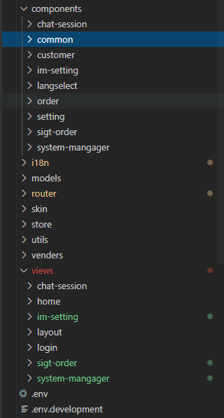
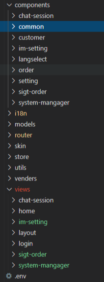
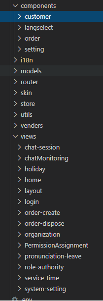
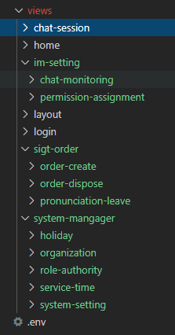

# view/component边界

## views-components

>要求

* view是页面级组件，业务视图组件，不可以被复用
* views文件夹建议按大模块划分，再在各模块文件夹下新建具体的视图页目录
* 原则上尽量扁平化，层次不要超过3层。
* components是可以被复用的组件，也是views里的视图组件的各个微小单元
* components文件夹也可按大模块划分，公共组件放在common里面

**components目录 不推荐**



**components目录 推荐**



**views目录 不推荐**



**views目录 推荐**



## 业务复杂的component拆分

* 要求.VUE代码行数不能超过1000行，代码行数越大，后期越难维护
* 拆分小组件放在components下面

** 不推荐**
原始文件，html长度为1300多行

```ts
<template>
    <div class="org-user">
        <!----左侧树-------------------------------------------->
        <div class="left-box">
            <div class="left-top">
                <div class="org-operate">
                    <el-button @click="addOrgDialog" type="success" icon="iconfont icon-icon02">					新建</el-button>
                    <el-button @click="delOrgStructure" type="danger" icon="iconfont icon-							shanchu">删除</el-button>
                    <el-button @click="updateOrgDialog" type="primary" icon="iconfont icon-						bianji">编辑</el-button>
                </div>
                <el-input v-model="orgKeyWord" suffix-icon="el-icon-search"></el-input>
            </div>
            <!----left-body----------------------------------->
            <div class="left-body">
                <el-tree :data="structureData" node-key="structNodeId" ref="orgTree" empty-						text="没有数据"  default-expand-all :expand-on-click-node="false" @node-					click="getNodeData":props="setProps" :filter-node-method="filterNode" 						highlight-current="true">
                </el-tree>
            </div>
        </div>
        <!----右侧部分------------------------------------------->
        <!----右侧下半部分-用户信息---------------------------------->
        <!-- </div> -->
        <div class="right-box">
            <!--用户列表搜索区-->
            <div class="operate-area">
                <el-input v-model="userKeyWord" class="search" placeholder="用户名/员工编号"></el-input>
                <el-button @click="searchUser" type="primary" class="btn-other" icon="iconfont icon-piaojulishixinxichaxun">查询</el-button>
                <el-button @click="addUserDialog" type="success" class="operate-button" icon="iconfont icon-icon02">新建</el-button>
            </div>
            <!--用户列表-->
            <div class="user-list">
                <el-table :data="userData" >
                    ...
                </el-table>
            </div>
        </div>
        <!-- 添加和编辑机构dialog -->
        <el-dialog title="机构信息" :visible.sync="orgDialogVisible" width="650px" :close-on-click-modal="false">
            <el-form :model="orgData">
              ...
            </el-form>
            <div slot="footer" class="dialog-footer">
                <el-button @click="closeOrgDialog">取 消</el-button>
                <el-button type="primary" @click="saveOrgstructure">确 定</el-button>
            </div>
        </el-dialog>
        <!--添加用户界面-->
        <el-dialog title="用户信息" :model="userInfo" :visible.sync="userDialogVisible" width="650px" :close-on-click-modal="false">
            <el-form :model="userInfo" v-loading="userSaveLoading">
              ...
            </el-form>
        </el-dialog>
    </div>
</template>

<script lang="ts" src="./org-user.ts">
</script>

<style lang="scss" scoped src="./org-user.scss">
</style>
```
** 推荐**
对原文件进行拆分，拆分成小的组件

```ts
<!-- 组织机构 -->
<template>
  <div class="organization">
    <OrgManage></OrgManage>
    <UserManage></UserManage>
  </div>
</template>
<script lang="ts" src="./organization.ts">
</script>
<style lang="scss" scoped src="./organization.scss">
</style>
```

```ts
<template>
 // 组织机构管理
  <div class="org-manage">
    <div class="left-top">
      <div class="org-operate">
        <el-button @click="add" type="success" icon="iconfont icon-icon02">新建</el-button>
        <el-button @click="del" type="danger" icon="iconfont icon-shanchu">删除</el-button>
        <el-button @click="edit" type="primary" icon="iconfont icon-bianji">编辑</el-button>
      </div>
      <el-input v-model="KeyWord" suffix-icon="el-icon-search"></el-input>
    </div>
    <div class="left-body">
      <el-tree
        :data="structureData"
        node-key="structNodeId"
        ref="orgTree"
        empty-text="没有数据"
        default-expand-all
        :expand-on-click-node="false"
        @node-click="getNodeData"
        :highlightCurrent="false"
        :props="setProps"
        :filter-node-method="filterNode"
      ></el-tree>
    </div>
    <OrgInfo :visible.sync="visible" :data="data" />
  </div>
</template>
<script lang="ts" src="./org-manage.ts">
</script>
<style lang="scss" scoped src="./org-manage.scss">
</style>
```
