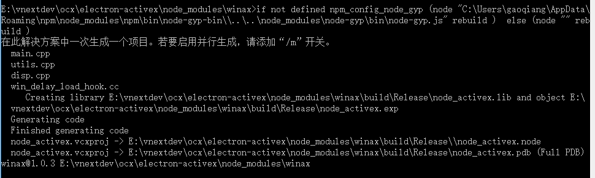
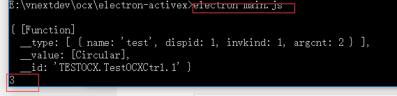

# electron 中怎么使用activex

1. 安装winax
```
npm install winax --save
```
2. 编译winax与当前electron内核相同版本
```
npm rebuild winax --runtime=electron --target=1.6.5 --disturl=https://npm.taobao.org/mirrors/atom-shell --build-from-source
```


3. 在electron中使用winax调用ocx代码
```
const BrowserWindow = electron.BrowserWindow

const path = require('path')
const url = require('url')

require('winax');
var testOCX = new ActiveXObject("TESTOCX.TestOCXCtrl.1");
var result = 'ok';
try{
  console.dir(testOCX);
  var result = testOCX.test(1,2);
  console.log(result);
} catch(ex){
  result = ex.message;
  console.log(result);
  console.log(ex.stack);
}
```

效果如下，

