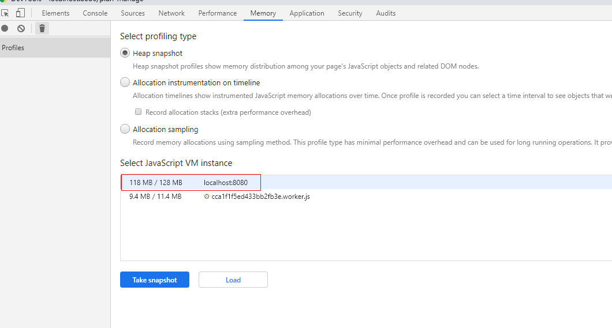
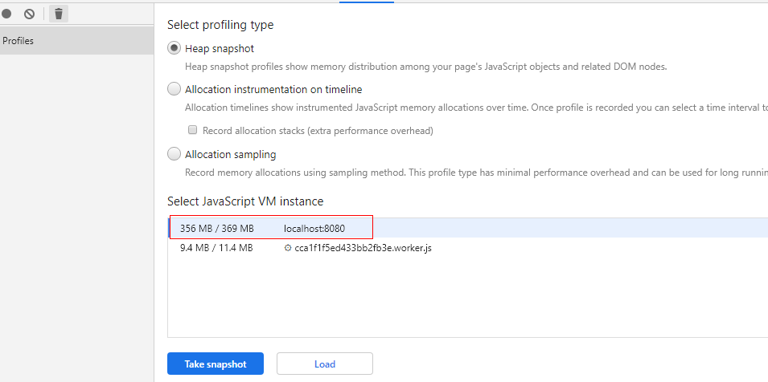
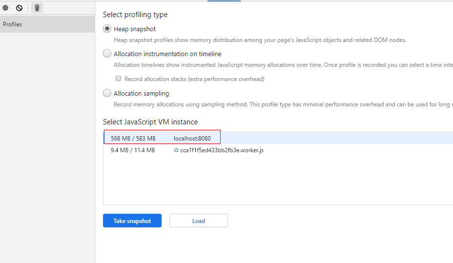
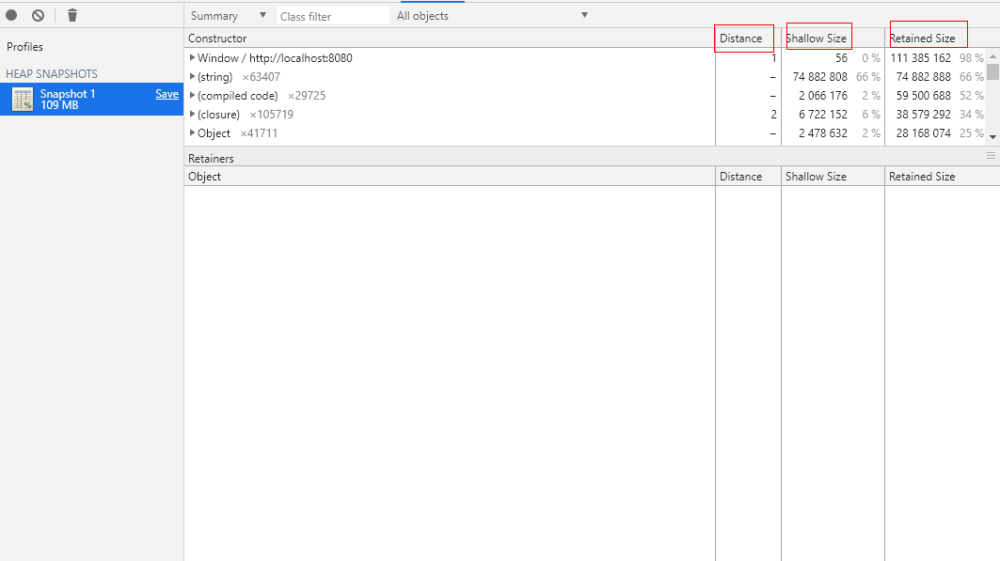
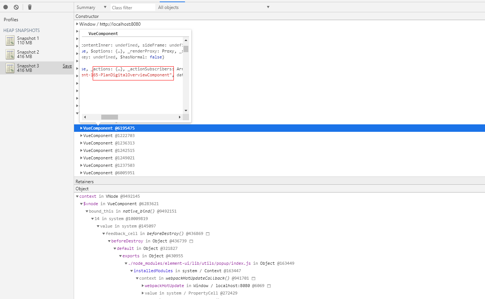
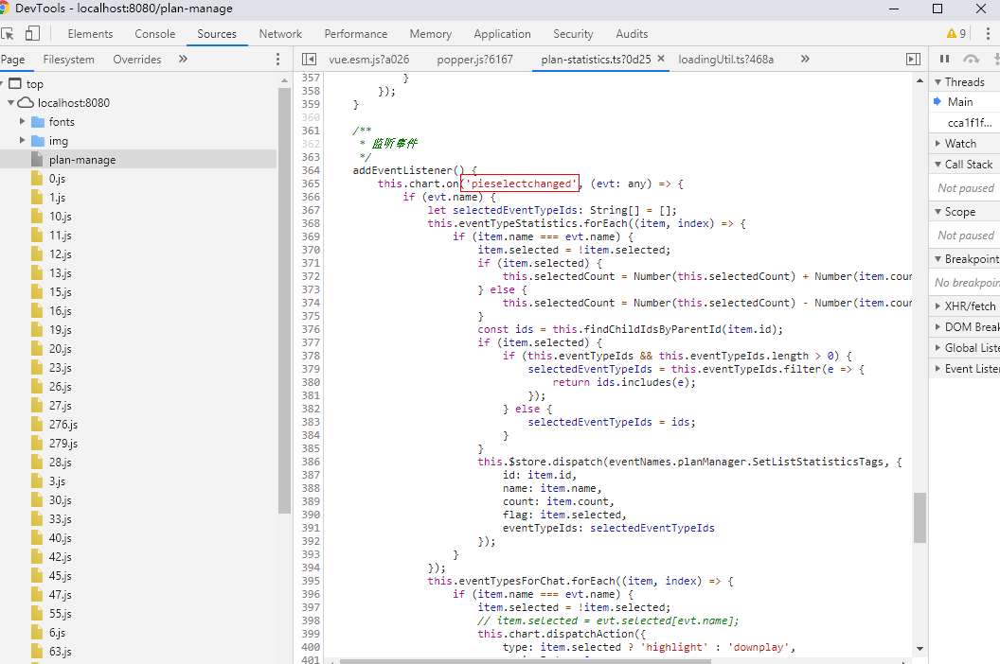
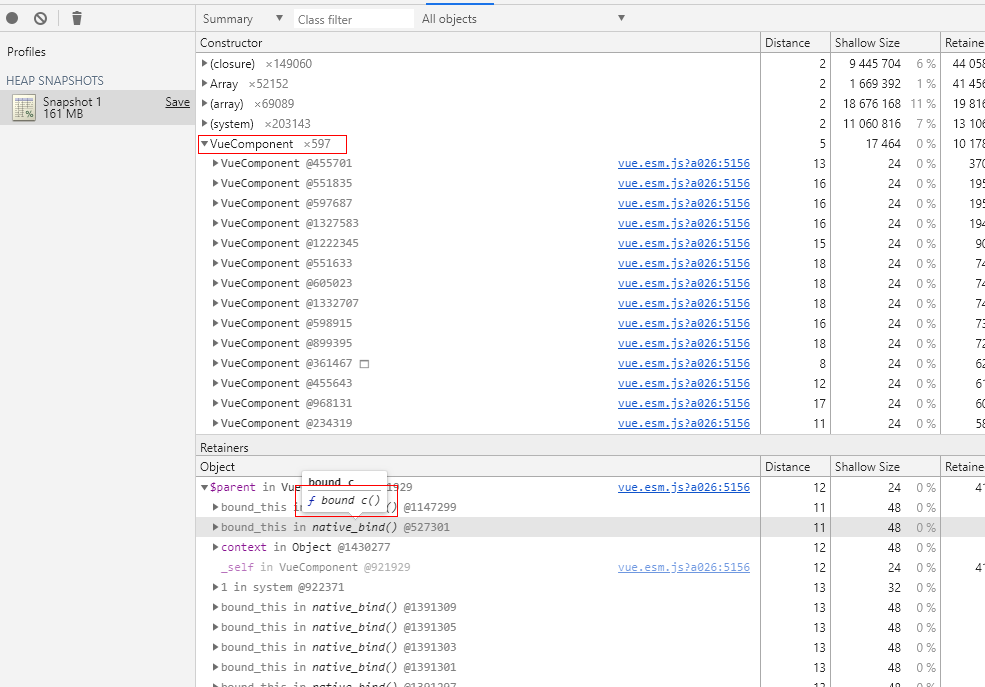
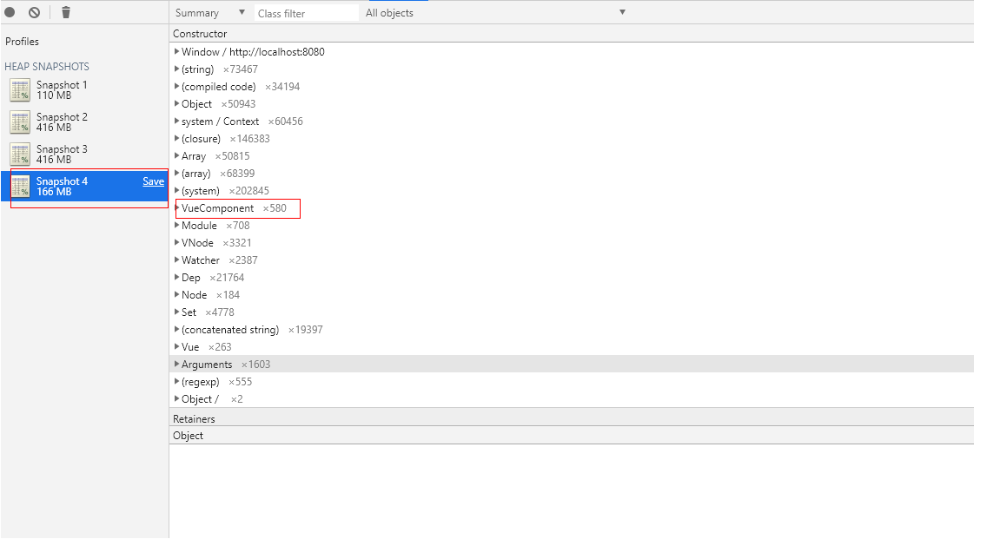

# 如何借助chrome开发工具一步一步分析内存溢出

## 背景
基于VUE+elementUI框架开发web单页应用，随着业务模块累计增加，应用程序体积增大，web浏览器内存也一直在增大。刚开始也一直没在意，认为这些都是正常现象，毕竟高级语言都有自己的垃圾回收机制。
直到浏览器直接崩溃或直接在开发模式下报错提示内存不足，才意识到web前端代码也会存在内存溢出情况。

## 内存溢出现象
1. 在不刷新浏览器的条件下，随意切换路由，浏览器内存只增不减
2. 浏览器在开发模式下直接报错提示内存不足中断
3. 浏览器直接奔溃

例举现象1说明：
1. 初始化进入系统首页，系统内存约占用118M/128M

2. 进入某个业务路由A，系统内存占用355M/367M(提示：可以手动回收内存，是内存保持在这个状态下相对稳定)

3. 再次路由跳转回到首页，系统内存占用356M/369M
355M/367M
4. 再次进入业务路由A，系统内存占用568M/583M，相当于新增了200+M内存。(理论情况内存应该维持在355M/367M这个范围)
355M/367M
5. 如此反复操作，内存不断以200M速度增长，直到浏览器在开发模式下报错提示内存不足中断

## 工具使用说明
工具：Chrome devtools的内存检测工具

然后打开devtools，切到Memory的tab，选中Heap snapshot，如下所示：


    heap snapshot： 堆快照，给当前内存堆拍一张照片。因为动态申请的内存都是在堆里面的，而局部变量是在内存栈里面，是由操作系统分配管理的是不会内存泄露了。所以关心堆的情况就好了。

点击Take snapshot，如下图所示，


    Shallow Size： 直接占用内存，不包括引用对象占用的内存
    Retained Size： 占用所有内存，包含用于对象占用的内存

详细其他说明不在这介绍了。

## 逆向分析

现象A： 进入首页=》进入某个业务路由A=》再次路由跳转回到首页，重复此操作，
内存以200M只有速度增长


1. 步骤： 进入首页(点击Take snapshot生成快照1)=》进入某个业务路由A(点击Take snapshot生成快照2)=》再次路由跳转回到首页(点击Take snapshot生成快照3)

快照3如下图，

再次路由跳转回到首页，业务A组件VueComponent对象没有释放，

排在前面没有释放的Object全部都是关于业务组件A VueComponent对应Store的对象。

代码改造 = 》
```js
/*   1. 释放业务组件A相关的Store及内部缓存变量
 *   在Vue声明周期钩子 beforeDestroy() {} 中添加释放store代码
*/
this.clearStoreData(); // 清除store数据
this.clearData();      // 清除组件缓存数据
```

清除后，内存情况得到明显改善，再次路由跳转回到首页，内存169M/179M。


2. 在Class filter中搜索deta(表示游离的dom元素，需要清理)，如下图


点击.ts文件跳转过去，发现代码监听了'pieselectchanged，在组件销毁时没有off(以及EChart没有dispose)



代码改造 = 》

```js
/*   1. 释放EventListener
 *   在Vue声明周期钩子 beforeDestroy() {} 中添加代码
*/
beforeDestroy() {
    if (this.chart) {
        this.chart.off('pieselectchanged');
        this.chart.dispose();
    }
}
```

清除后，再次路由跳转回到首页，内存167M/176M。


3. 在VueComponent找到业务组件A VueComponent（未释放的VueComponent597个），点击查看Retainers对象，如下图，

这个是引入三方插件 vue-ts-css中的_c渲染函数导致


代码改造 = 》
```js
/*   1. 释放第三方插件中的bind及对象
 *   在Vue声明周期钩子 beforeDestroy() {} 中添加代码
*/
beforeDestroy() {
    this._c = null;
    this.original_c = null;
    this.$parent = null;
    this.original$createElement = null;
    this.$createElement = null;
    this.$options = null;
}
```
清除后，再次路由跳转回到首页，未释放的VueComponent只有580个。


到此，内存基本处于稳定，但是还有问题，多次上面操作，内存仍以10M左右的速度增长。

## 正向分析

现象B： 进入首页=》进入某个业务路由A组件=》再次路由跳转回到首页，重复此操作，
内存以10M只有速度增长 

结合逆向分析结果及我们操作的路由组件，我们使用排除法，逐个注释业务路由A组件中的子组件，最终发现
业务路由A组件中的子组件=》ControlComponent，当注释掉它的时候，反复现象B中的操作，内存趋于稳定
没有以10M方式增长

Review ControlComponent中的代码发现：
```js
// 用于全屏状态控制
mounted() {
    document.body.addEventListener('fullscreenchange', this.fullScreenHandler.bind(this));
  }

/*
** 问题： 
* 1. 在全局addEventListener后没有及时remove
* 2. 将当前ControlComponent-》this引用绑定到全局对象，导致ControlComponent在组件销毁时内存不释放
*/
```

代码改造 = 》
```js
/*
* 1. 去掉this引用绑定
*/
mounted() {
    document.body.addEventListener('fullscreenchange', this.fullScreenHandler);
  }
/*
* 2. 在beforeDestroy中remove 'fullscreenchange'事件
*/
beforeDestroy() {
    document.body.removeEventListener('fullscreenchange', this.fullScreenHandler); 
    this.fullScreenHandler = null;
  }
```

现象C： 进入首页=》进入某个业务路由A组件,点击功能A1=》再次路由跳转回到首页，
内存没有回收到现象B初始化状态大小

找到A1组件，注释掉以下代码，重复现象C操作，内存恢复正常
```js
/*
* 通过注解获取store中对象
*/
 @Getter('newDigital_componentContentList')
componentContentList!: ComponentContent[];

let _componentContentList = this.componentContentList.filter(item => {
            return String(item.content).includes(this.keyWords.toString())
                || String(item.treeNodeName).includes(this.keyWords.toString());
        });
```

代码改造

```js
/*
* 错误改造方式,这样改造代码对象引用并没有释放，内存泄漏问题依然存在
*/
_componentContentList = [];
beforeDestroy() {
    this.$store.state.newDigital.componentContentList = [];
    this.componentContentList = [];
}

/*
* 正确改造方式，注释下面代码
* 在使用componentContentList位置，直接使用this.$store.state.newDigital.componentContentLis
*/
// @Getter('newDigital_componentContentList')
// componentContentList!: ComponentContent[];

let _componentContentList = this.$store.state.newDigital.componentContentList.filter((item: any) => {
            return String(item.content).includes(this.keyWords.toString())
                || String(item.treeNodeName).includes(this.keyWords.toString());
});
_componentContentList = [];

beforeDestroy() {
    this.$store.state.newDigital.componentContentList = [];
}
```


```到此，内存泄漏问题基本解决。```

## 总结
引发web前端内存溢出的情况很多很多，如

1. 全局对象很大，没有及时清理，比如vuex，store
2. bind或on 添加EventListener事件，没有及时unbind或off
3. 引入第三方插件，如EChart，没有及时清理
4. 闭包变量没有及时清理
5. Vue官方推荐正确使用v-if，防止内存溢出

最后，具体问题还需具体分析，这里只是提供一些分析的方法和思路，希望能给大家一些帮助。

## 参考资料

1. https://www.cnblogs.com/callmeguxi/p/6846447.html

2. https://github.com/vuejs/vue/issues/4990