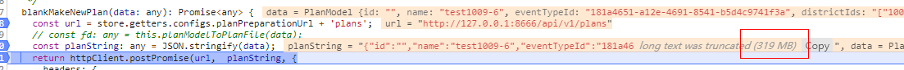

[TOC]

## post大对象浏览器崩溃

### 问题背景

* 基于web开发，使用的浏览器 Chrome (版本：74)
* 使用Axios的post方法向服务端发送大对象的请求


### 问题描述

* 对象、字串体积超过300Mb左右，谷歌浏览器内存溢出，浏览器崩溃，上传中断

* 问题截图：




* 浏览器崩溃时，前端和服务端处理该问题的代码片段

  前端发送请求代码片段：

  ```typescript
    postBibObject(data: any): any {
      const url = store.getters.configs.testUrl + '/big-object';
      return axios.post(url, data);
    }
  ```

  服务端接收该请求代码片段：

  ```java
      @PostMapping(value = "/big-object", produces = MediaType.APPLICATION_JSON_VALUE)
      public ResponseEntity<BigObjectModel> addOneBigObject(  @RequestParam     			@ApiParam(value = "bigObjectModle", required = true) BigObjectModel bigObjectModle 		) {
          BigObjectModel result = bigObjectService.addOneBigObject(bigObjectModle);
          return new ResponseEntity<>(result, HttpStatus.OK);
      }
  ```

### 解决思路及方法

* 在前端将大的对象、字符串转换成二进制，以二进制形式向服务端传输（项目中，300Mb的字符串被转换成二进制时约160MB，降低内存开销），Blob一个字段可存储多达4GB的数据，Blob还提供了slice方法，将一个对象依据起始偏移量和结束偏移量，将对象切片，从而避免一次性操作体积大的对象

。


```typescript
  const bolb = new Blob([JSON.stringify(param)])
```

* 在服务端使用HttpServletRequest接收，在把二进制转换所需对象

```java
  String bigStr = IOUtils.toString(request.getInputStream(),"utf-8");
```

* 解决该问题的代码片段

  前端：

```typescript
  postBibObject(data: any): any {
    const url = store.getters.configs.testUrl + '/big-object';
    const fd = new Blob([JSON.stringify(data)]);
    return axios.post(url,  fd, {
      headers: {
        'content-type': 'application/json'
      }
    });
  }
```

  服务端：

```java
  @PostMapping(value = "/big-object", produces = MediaType.APPLICATION_JSON_VALUE)
  public ResponseEntity<BigObjectModel> addOneBigObject( HttpServletRequest request  		) throws IOException {
      String bigStr = IOUtils.toString(request.getInputStream(),"utf-8");
      BigObjectModel bigObjectModel = 		                                      			JsonUtil.fromJson(bigStr,BigObjectModel.class);
      BigObjectModel result = bigObjectService.addOneBigObject(bigObjectModle);
      return new ResponseEntity<>(result, HttpStatus.OK);
  }
```

### 问题延伸

上传超大文件设计思路:

* 前端把大文件利用Bolb的slice切割成多个子文件，每次切片发送一个请求
* 后端把每次接收的二进制文件流进行重组，转换成相应形式进行存储

注：后端需要分配大的堆空间，防止溢出