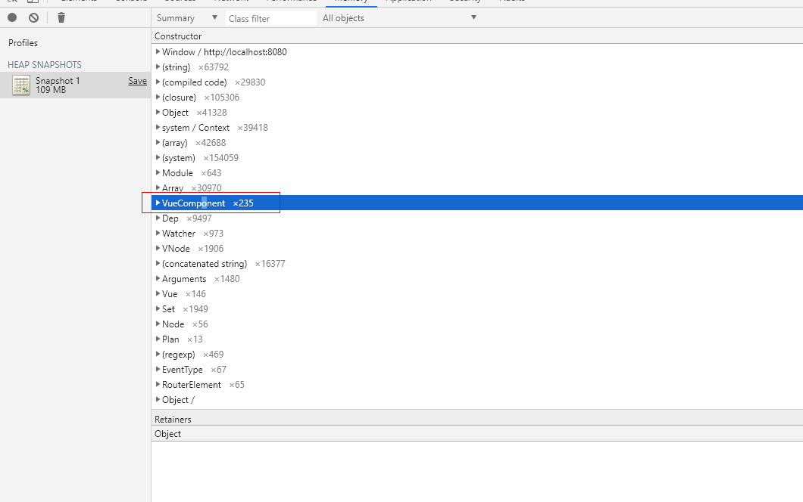
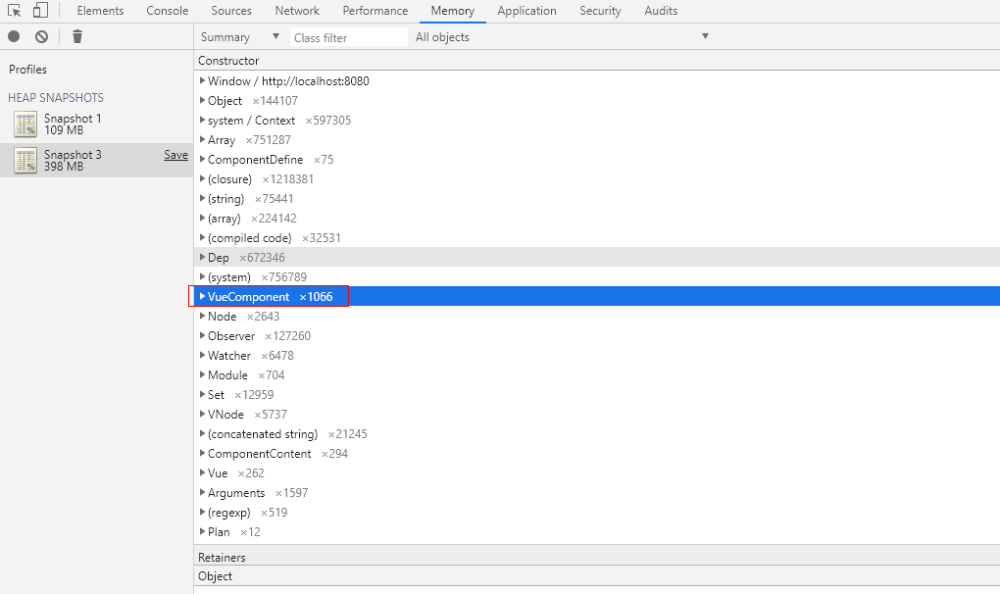
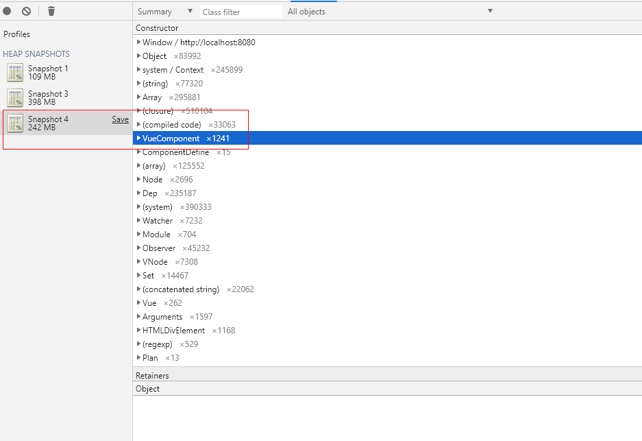
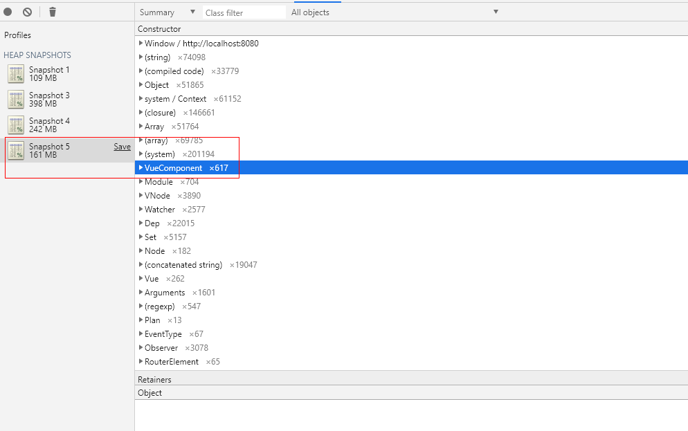

# 内存溢出篇-如何快速释放VUE-component[小技巧]

## 背景及现象说明
最近在使用chrome开发工具分析VUE相关项目内存溢出问题，在来回切换路由，注销组件时，发现大量的VueComponent没有释放。

结合具体业务场景： 
1. 初始化进入首页，VueComponent组件235个,如下图


2. 路由切换，进入业务组件A，VueComponent组件1066个,如下图


3. 路由切换，返回到首页，VueComponent组件1241个,如下图


问题：

1. 路由切换组件VueComponent没有释放
2. VueComponent没有释放，导致内存也一部分没有释放


## 解决方案两种
1. 代码调整，清空闭包引用，清除bind或off的事件对象，清除store对象等，具体参考
   [如何借助chrome开发工具一步一步分析内存溢出](./README.md)

2. ```小技巧```代码调整，在调整路由前，清空页面绑定对象，在$nextTick里面跳转
```js
    this.outlineDataSource = [];
    this.contentDataSource = [];
    this.outLineModels = [];
    this.planModel = new PlanModel();
    this.$nextTick(() => {
      this.$router.push({ name: 'plan-manage' });
    });
```

```为什么```： 

1. 在跳转前，清空页面绑定对象，VUE内部会执行自动渲染，把清空VueComponent交给VUE自己处理，清理得更彻底一些。到此，有人会问Vue会提供组件beforeDestroy、destroyed，为啥不在这些钩子函数中清理。是的，开始最先想到在这些钩子函数里面清理，但是这样只释放了数据，对于一些渲染过的dom及vNode，如果清理的先后顺序或各种组件对象关联不对，里面会残留很多游离的dom或vNode，致使很多VueComponent不能彻底清理。而重新渲染就不一样，它会首先清空VueComponent里面的相关vNode，再初始化化组件，此刻我们的数据都是空数据，相当于剪断了里面的复杂关联。在nextTick渲染完后，再次跳转。
2. 在一个复杂项目的后期，想要理清楚各组件之间的关系，按序清理各组件的store、event、闭包、action比较困难，所以，在复制组件路由跳转前做一次清空是相对而言比较简单的

调整后，VueComponent组件只有617个，内存也相应释放了，如下图，


## 进阶

    解决方案2 其实处理得并不优雅，它需要在每个复杂的页面路由跳转时进行处理。

    TODO: 使用Vue路由守卫能力，监视路由跳转钩子，在跳转前，统一将当前VueComponent里面对象置空，强制渲染，再调整路由