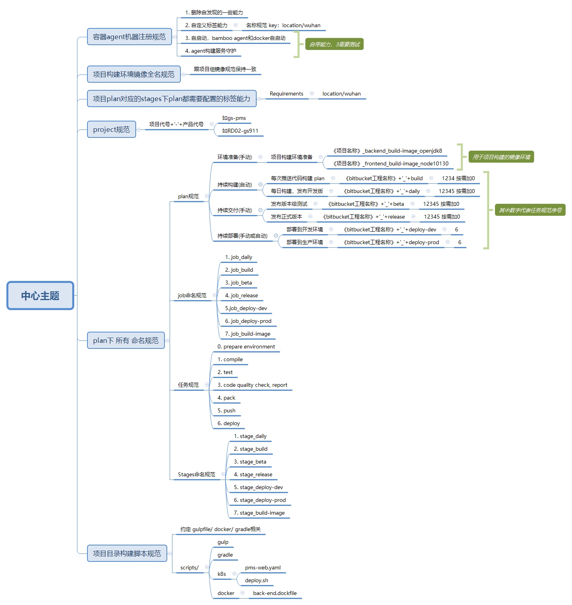

devops定义
<!-- TOC -->

- [Stages定义](#stages定义)
- [任务(task)定义](#任务task定义)
- [环境准备plan定义(手动)](#环境准备plan定义手动)
- [持续构建plan定义(自动)](#持续构建plan定义自动)
- [持续交付定义(手动)](#持续交付定义手动)
- [持续部署定义(手动或自动)](#持续部署定义手动或自动)
- [构建任务选择原则](#构建任务选择原则)

<!-- /TOC -->

这里是以预案管理项目为例来介绍devops里面一些过程定义，可适用bamboo及jenkins。

## .1. Stages定义
两个Stages
```sh
1. xxx_environment（用于服务端/客户端构建时所需要的环境，比如前端需要 设置npm私服cnpm地址，node sass .node内网镜像文件）

```

## .2. 任务(task)定义

```sh
0. prepare environment
1. compile
2. test
3. code quality check, report
4. pack
5. push
6. deploy
```
`特别说明`
1. 按正常情况 test任务应该在sonarquber之后，但是因为sonarquber任务需要把test相关测试报告一起上传到sonarquber平台，所以，将他们顺序调整。

## .3. 环境准备plan定义(手动)
1. 服务端环境镜像准备
```sh
《项目名称》_backend_build-image_openjdk8
```

2. 前端环境镜像准备
```sh
《项目名称》_frontend_build-image_node10130
```

`注意点`
1. 如果部门的基础镜像已经满足构建需求，则无需创建plan

2. 设置成手动构建，如果构建环境不变，不需要再次手动执行plan

3. push到镜像仓库的镜像应该归属项目组管理

4. 镜像规范应与项目镜像规范保持一致


## .4. 持续构建plan定义(自动)
详见见下图


## .5. 持续交付定义(手动)
详见见下图


## .6. 持续部署定义(手动或自动)
详见见下图


## .7. 构建任务选择原则
1. 不能影响主机(bambooo agent)环境
2. 尽量符合bamboo自己风格

