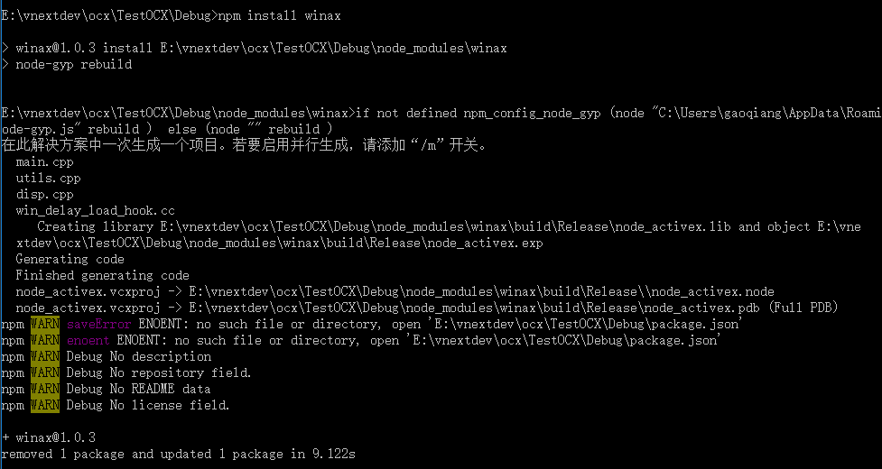
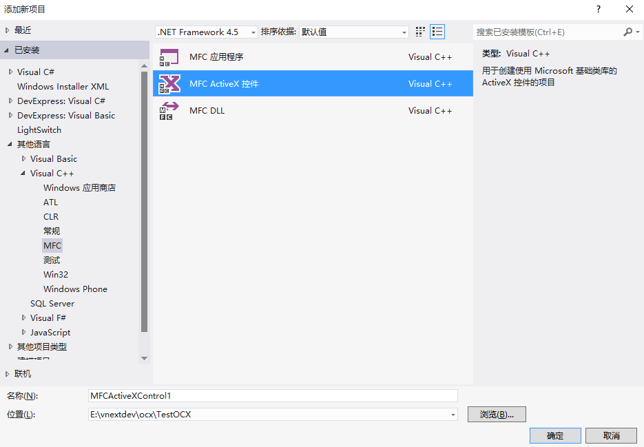
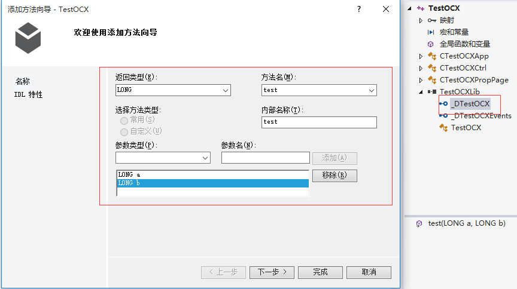
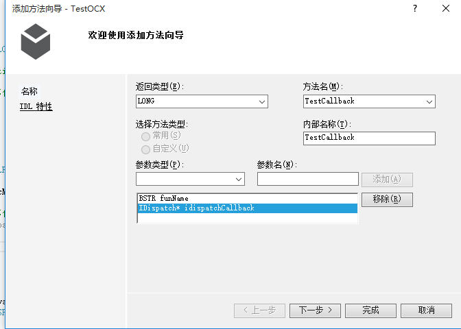
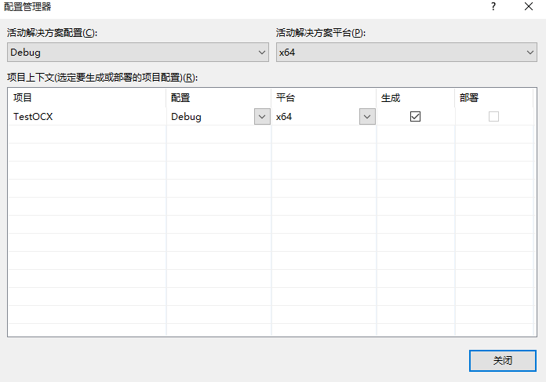
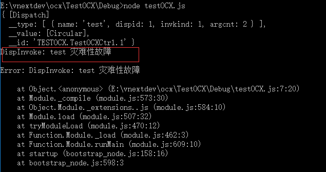
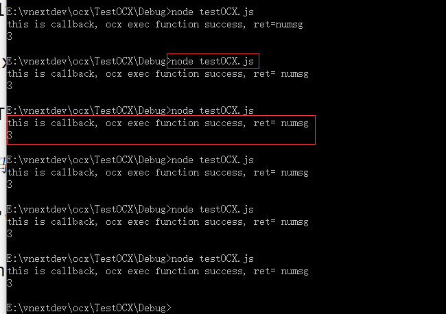

# node-activex实践方案
这里是在nodejs里调用activex的实践示例。

## 1. 环境准备
1. node开发环境 v8.4.0
2. c++开发环境  vs2012
3. 平台支撑：win10企业版 x64
4. python2.7

## 2. 安装winax
在node环境中集成activex主要使用的插件是winax([什么是winax?](https://www.npmjs.com/package/winax))。

在使用npm安装winax之前我们需要准备好node-gyp编译环境，因为winax是一个原生的node模块，在不能版本的node环境中使用，首先需要对它进行编译。

node-gyp编译环境：
1. python2.7
2. vsexpress

还一种简单方法（前提是需要连接外网），在管理员账户下执行:
```
npm install --g --production windows-build-tools
```
会自动安装node-gyp编译环境。

编译环境准备好后，先执行
```
npm install -g node-gyp
```
在指定开发目录执行
```
npm install winax
```



## 2. 编写ocx
直接使用MFC ActiveX控件向导创建一个简单ocx。



切换到类视图，添加一个简单对外方法test



切换到类视图，再添加一个简单对外方法TestCallback



编译成功后！在开始菜单中以管理员的账户运行cmd，执行OCX的注册
```
regsvr32 testOCX.ocx
```
```
regsvr32 testOCX.ocx /u  //反注册
```

这里有两个需要注意的地方：
1. 注意运行平台，修改成x64



2. activeX默认对外的API IsInvokeAllowed是false，导致在nodejs中调用ocx的接口时，出现灾难性故障的问题。

解决方案如下，在TestOCXCtrl.cpp中重写IsInvokeAllowed方法，代码如下，
```
BOOL CTestOCXCtrl::IsInvokeAllowed (DISPID)
{
	return true;
}
```
到此ocx编写完成。[源码地址](https://github.com/numsg/web-dev/tree/master/10nodejs/src/ocx)

## 2. 编写调用ocx的js文件
具体实现调用ocx的js代码如下，
1. 调用ocx一般方法,如下，传递两个long类型参数做一个加法计算
```
var result = testOCX.test(1, 2);
```
2. 调用ocx特殊方法,如下，传递callback方法过去，当ocx主线程有新数据，主动触发js回调事件。
```
testOCX.TestCallback('numsg', callback);

全部js代码如下，
```
require('winax');

(function(){
  try{
    var testOCX = new ActiveXObject("TESTOCX.TestOCXCtrl.1");
    //向ocx中注册一个callback，ocx那边立即执行callback
    testOCX.TestCallback('numsg', callback);
    //调用ocx中的test方法
    var result = testOCX.test(1, 2);
    console.log(result);
  } catch(ex){
    console.log(ex.message);
  }

  function callback(strNum){
    console.log("this is callback, ocx exec function success, ret= " + strNum);
  }
  
})()
```
调用成功结果如下图，


node-activex实践方案到此结束。
