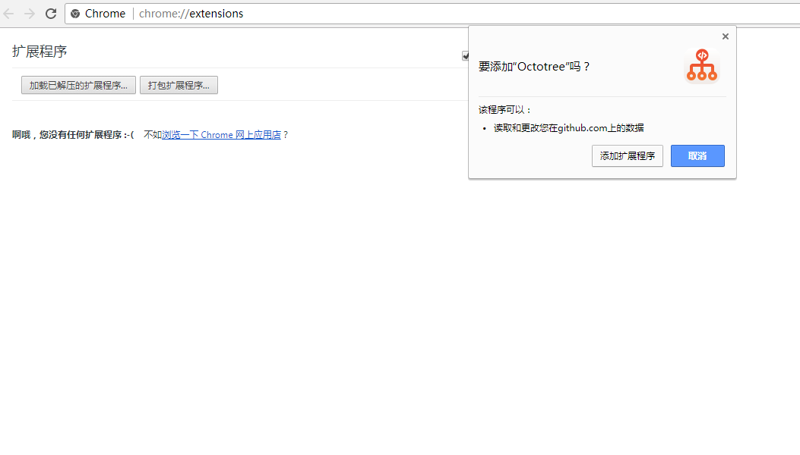
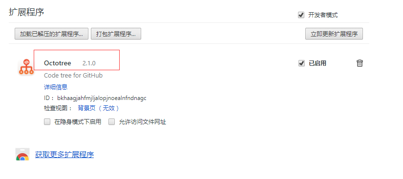
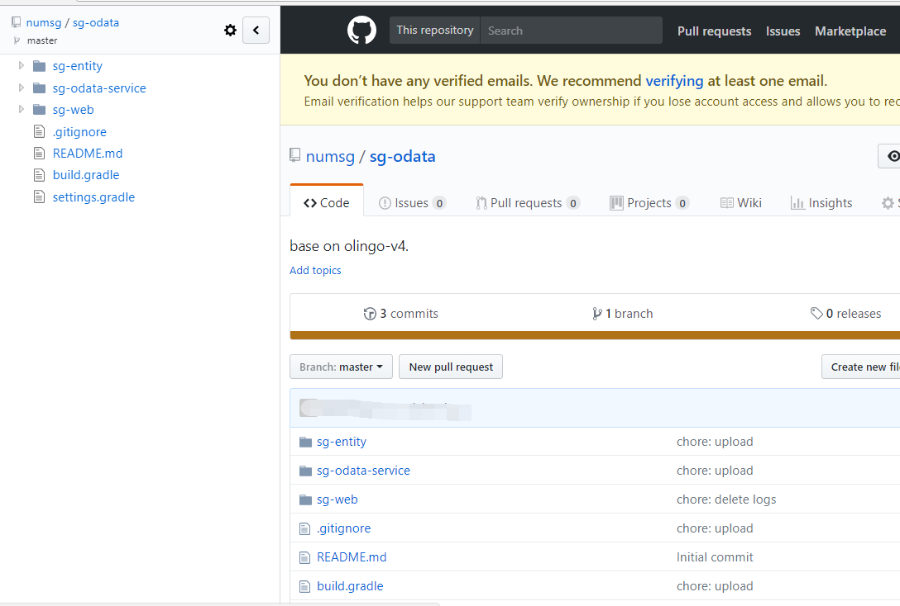

# Octotree Chrome插件离线安装

[Octotree插件下载地址](https://github.com/numsg/web-dev/blob/master/11other/tools/Octotree-2.1.0-Crx4Chrome.com.crx)

## 1. 简单介绍
Octotree 是国外程序员Buu Nguyen 做的一个 Chrome 插件。安装之后，浏览托管在Github上的项目，可看到左侧的树形结构，更方便查看代码…… （有点 IDE 的感觉，用着好来点个赞吧）

特性如下：

1. 像 IDE 那样方便地浏览代码
2. pjax 支持快速浏览
3. 支持热键切换代码树
3. 支持私有仓库 

目前，Chrome官方已经禁止非Chrome商店的应用安装了，所以本站的应用还是通过国外服务器从谷歌官方应用市场下载下来的，提供给国内的广大用户使用，下面我们就以 Octoctree插件为例，来讲一下本站下载的插件如何安装到Chrome浏览器！

## 2. 安装步骤

1. 点击下载链接，进入下载页面，下载CRX格式文件
2. 在chrome中新开一个TAB，输入：chrome://extensions/ 回车，打开应用管理器，可以看到之前安装的其他应用，然后把刚才下载的CRX格式文件拖到浏览器中。

3. 好了，可以随便打开一个github仓库验证了
